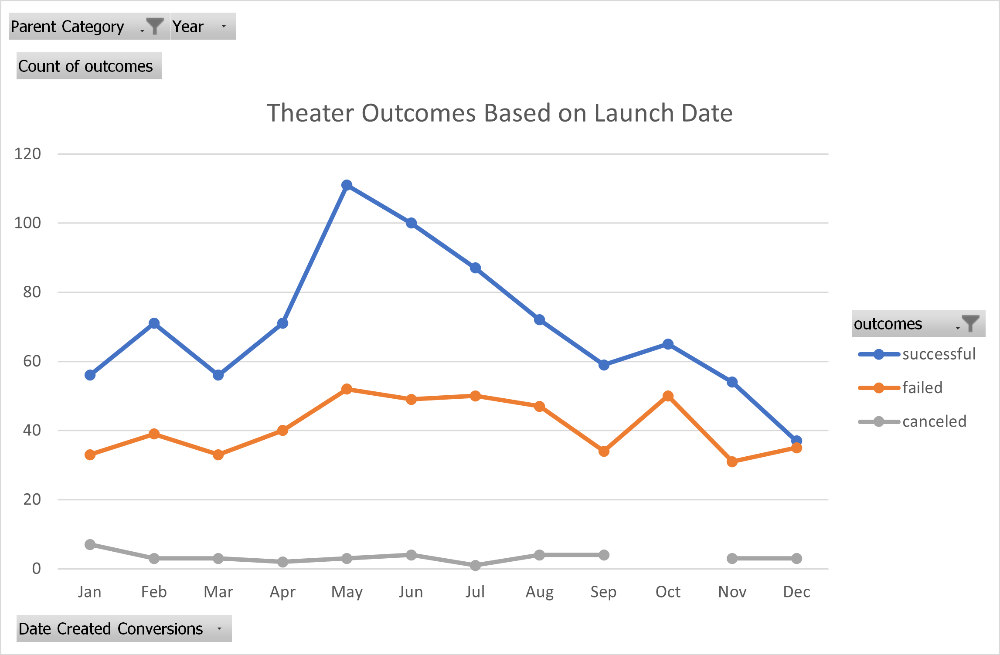
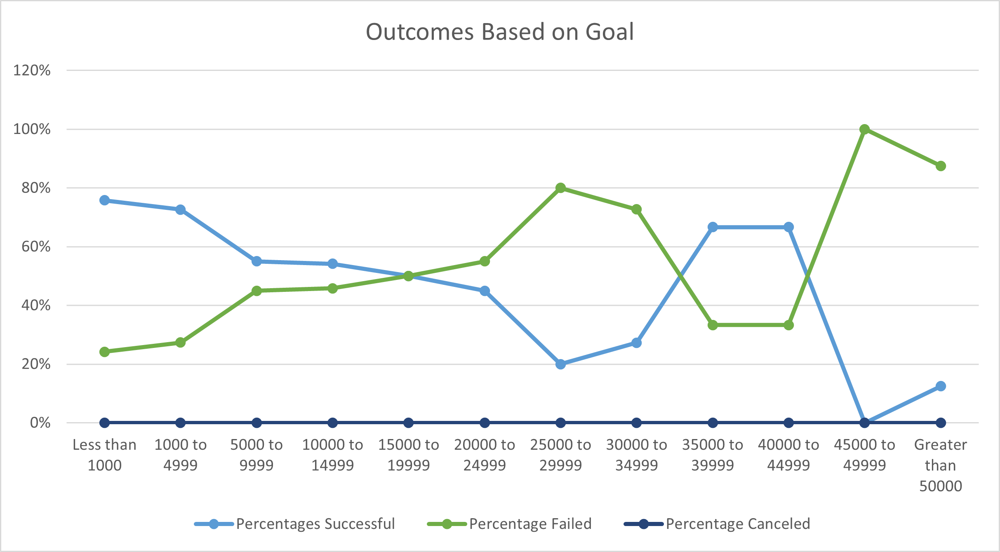

# kickstarter-analysis
Performing analysis on Kickstarter data to uncover trends

# Kickstarting with Excel

## Overview of Project

This anaylsis project was done to determine the likelihood of a Kickstarter campaign being successful. The campaign is to be started by Louise a playwright who just finished her next play, Fever. She is looking to launch a $10,000 Kickstarter campaign but also is wondering if it is likely to be successful. In this project we looked analyzed a set of Kickstarter campaign data to determine the possible outcome for Louise's upcoming campaign.

### Purpose

In order to project if Louise's campaign is likely to be successful or not, information from Kickstarter campaigns across the world and across different categories was analyzed. To determine relevant analysis, the data was filtered by the parent category "theater" and also by the subcategory "plays". With this data, outcomes of past campaigns were looked at based on different factors such as date the campaign began and the goal price of the campaign to determine the chances of Louise's $10,000 campaign for her new play.

## Analysis and Challenges

### Analysis of Outcomes Based on Launch Date

One important factor found was change in outcome based on the Launch Date of the campaign. To find the outcomes based on launch date, the data was put into a pivot table to be filtered by the parent category "theater". Another filter for year was added to see the count of successful, failed and canceled theater campaigns for each month. The graph here shows that theater campaigns had higher numbers throughout the year than failed or canceled campaigns. Of the successful campaigns, most of them were launched in the summer months from May-August with another slight rise in successful campaigns launched in October. The most failed campaigns did also occur in those same group if months as well.

### Analysis of Outcomes Based on Goals

Another important factor was the goal amount for a campaign which was analyzed for capmapigns in the subcategory "plays". The percentages of successful, failed and canceled outcomes was determined based on $5,000 ranges from $1,000 to $50,000. The graph below shows how the data came about. Campaigns with a goal of less than $15,000 had a higher percentage of successful campaigns than campaigns with higher goal amounts.

### Challenges and Difficulties Encountered

Possible diffficulties that could be encountered while performing an analysis like this would be a lack of proficiency in pivot tables and pivot charts. Without pivot tables, the data can be analyzed still but it would take much longer than it would if a pivot table was used. 

## Results

Based on the Outcomes based on Launch Date analysis, Lousie's campaign has a better chance of being successful if launched between the months of May and August. Based on the Outcomes based on Goals analysis, Lousies's campaign has a 54% chance of being successful if she keeps the $10,000 goal. The changing amounts of campaigns in available limit the dataset because of inconsistent amounts of campaigns between datasets. For example in determining the Outcomes Based on Goals, there is a larger percentage of successful than failed campaigns for the ranges 35000 to 39999 and 40000 to 44999, but these ranges also have less than 10 campaigns in the data set as well. Other possible tables that could be created are the outcomes for campaigns of plays based on duration of the campaign and the outcomes of campaigns based on the number of backers would be helpful for Louise to see in determining whether to do her campaign.
